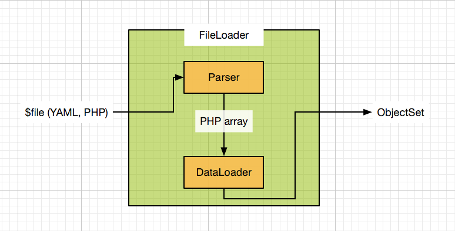
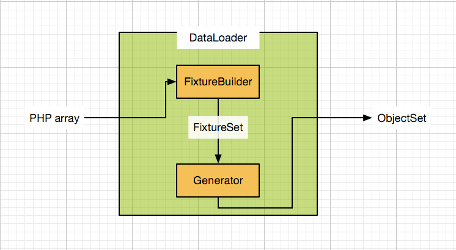

# Contribution Guide

This guide is for those who want to have a better understanding of the library internals and how to contribute.
The code and the tests are the best documentation you will find, so the guide only aims at introducing the higher
picture of the library mechanisms.

1. [Differences between 2.x and 3.x](#differences-between-2x-and-3x)
1. [Architecture](#architecture)
    1. [FixtureBuilder](#fixturebuilder)
    1. [Generator](#generator)
1. [Expression Language](#expression-language)
1. [Contributing](#contributing)
    1. [Testing](#testing)
    1. [Profiling](#profiling)

## Differences between 2.x and 3.x

Main differences between 2.x and 3.x:

- The persistence layer has been removed
- Rewrite of the API to make it more extensible and more robust
- Change in the architecture to address some limitations found in 2.x

## Architecture

The two entry points of the library are the `DataLoader` and `FileLoader`:

    
    

Alice's goal is to render a PHP array containing a description of objects and parameters (with support for injected external objects
and parameters) into a set of objects called `ObjectSet`.

In `DataLoader`, the main components are:

- `FixtureBuilder`: denormalizes the given PHP array into a comprehensible set of data called `FixtureSet`
- `Generator`: generates the objects and resolve the parameters described in `FixtureSet` to generate an `ObjectSet`

### FixtureBuilder

`FixtureBuilder` is composed of two components: `Denormalizer` and `ExpressionLanguage`.

`Denormalizer` transforms the input data array with the injected values into a collection of `Fixture`, which describes an object to
generate with a set of parameters.

`ExpressionLanguage` is the component used by the `Denormalizer` to parse the values such as `@user<current()>`, i.e.
the Alice DSL interpreter.

The result `FixtureSet` is always invariant: reloading the same set of data will always result in the same result, hence
is cacheable.

### Generator

The `Generator` transforms a `FixtureSet` (composed of `Fixture`, parameters, injected objects, and
injected parameters) into an `ObjectSet`, which is a collection of PHP objects and parameters. Because some data are
generated "randomly" thanks to [Faker][1], a `FixtureSet` will always give a different
`ObjectSet`. If there is no dynamic data, the result will always be the same. If [Faker][1] is seeded
with `null`, the data will be generated more or less randomly. For a given seed, though,
the data generated will always be the same.

The data is generated in the following order:

1. Fixture Resolution (`FixtureSet`):
    1. Resolve the parameters: it is assumed the injected parameters are already resolved. Existing parameters are
    overriden by the local ones if they conflict.
    2. Resolve the fixtures: a fixture may have *flags* (for example, to support
    [templates](https://github.com/nelmio/alice/blob/master/doc/fixtures-refactoring.md#fixture-inheritance)).
    This resolution step is where it is possible to alter the collection of fixtures depending on the flags. In the
    templates example, this is the step where a `dummy` fixture inheriting from a `base_dummy` will
    inherit the properties of `base_dummy`, and `base_dummy` will be removed of the list of fixtures
    (templates should not be generated).
1. Instantiation: This when *all* fixtures will be instantiated. The
instantiation attempts to account for the order. For example, if `second_dummy` is being instantiated but
requires `first_dummy` to exist, the
instantiator will instantiate `first_dummy` before resuming the instantiation of `second_dummy`.
1. Hydration: This is when all the property values will be set.
1. Calling: Additional function calls can be made on the PHP objects after instantiation and hydration.

During the instantiation, hydration or calling process, values may be passed. Those values may be a reference to another
fixture, a parameter, a static value, but or a value that must be generated via faker. For example,
`<name()>` will result in a random name. Those values are always resolved on the fly by a `ValueResolver`.

To see more about the fixture lifecycle, please check [#388](https://github.com/nelmio/alice/issues/388).

For more details regarding a class, the easiest way is to check the code itself and the tests.

## Expression Language

As already mentioned, Alice ships with an Expression Language, which interprets values such as `@user*` or
`<current()>`. The complete list of supported features can be found in [ParserIntegrationTest](tests/FixtureBuilder/ExpressionLanguage/Parser/ParserIntegrationTest.php)
with the [original RFC](https://github.com/nelmio/alice/issues/377).

## Contributing

### Testing

The project uses [PHPUnit][2] for tests. The library also includes framework bridges (like
[for Symfony](https://github.com/nelmio/alice/tree/master/src/Bridge/Symfony)), which amounts to registering the right
services with the right properties (like tags and configuration) to the framework Dependency Injection Container. Any
other framework special features should be handled in another library, bundle, module etc.

To avoid any conflicts, the framework dependencies used by the bridges are installed in dedicated folders thanks to
[bamarni bin composer plugin][3] and [theofidry inheritance composer plugin][4]. As a result, if you want to run the
tests for Symfony, you must run the tests with `phpunit_symfony.xml.dist` instead of `phpunit.xml.dist`.

To run the tests use `make test`.

The tests should be descriptive and are "testdox friendly" i.e. if you are using the testdox
option, you will get something like:

    

### Profiling

A Profiling of different scenarii is done with [Blackfire][5]. The scenario can be found under `profiling`. If you wish
to run them, you can try to simply run `make tp` (for "test performances"). You may however have to touch some elements
of the blackfire configuration (see the `profiling/scenarioX/blackfire.php` files).

 

« [Advanced Guide](doc/advanced-guide.md) • [Table of Contents](README.md#table-of-contents) »

[1]: https://github.com/fzaninotto/Faker
[2]: https://github.com/sebastianbergmann/phpunit
[3]: https://github.com/bamarni/composer-bin-plugin
[4]: https://github.com/theofidry/composer-inheritance-plugin
[5]: https://blackfire.io/
